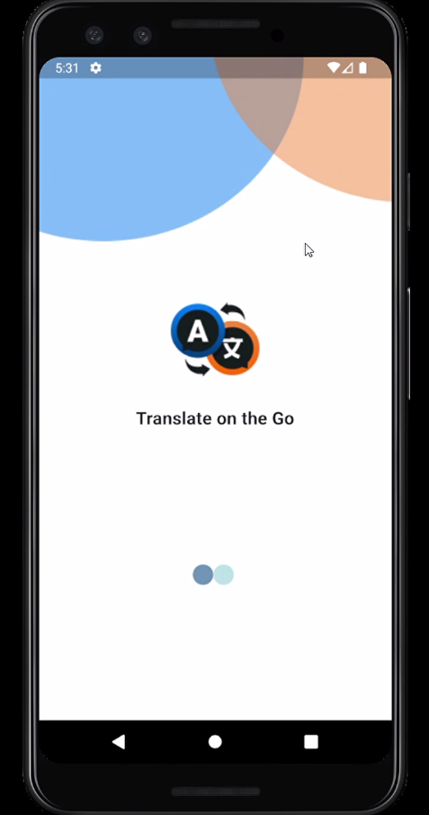
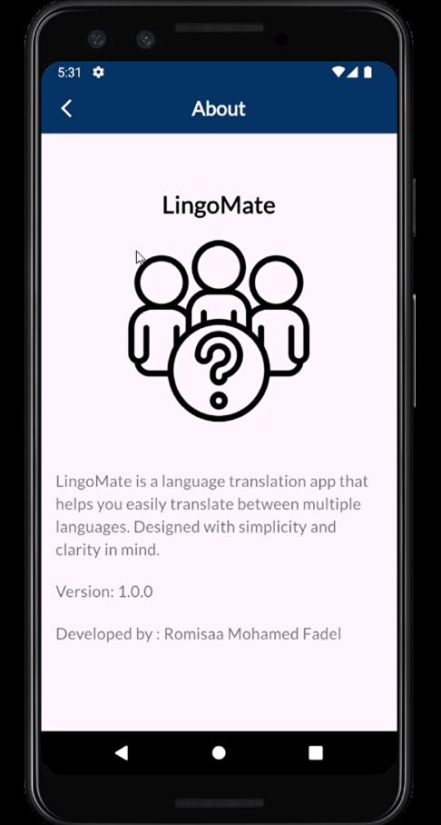
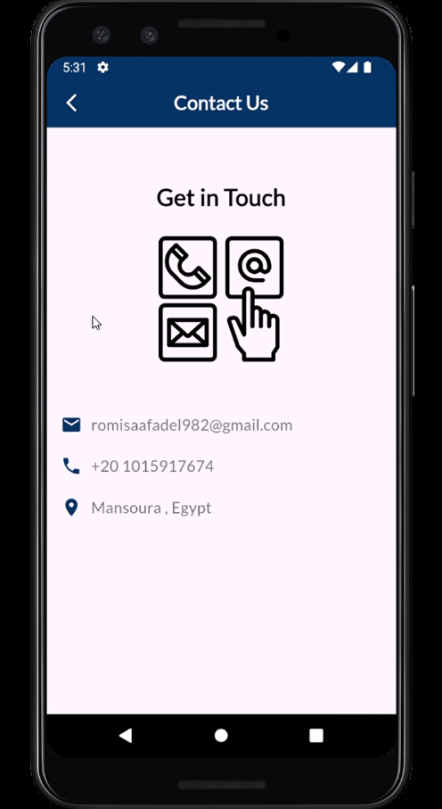

# 📱 LingoMate - Language Translator App

LingoMate is a Flutter application that provides easy and intuitive language translation using various input methods like text, camera, and voice chat.

---

## ✅ Features Implemented

- ✅ Splash Screen
- ✅ About Page
- ✅ Contact Page
- ✅ App Drawer with navigation to pages
- ✅ Bottom Navigation Bar with multiple views:
  - Chat
  - Camera
  - Translate
  - History
  - Favorites

---

## 🔧 Features In Progress

- ❌ Translate View logic
- ❌ Camera functionality (OCR/scan)
- ❌ Chat translation logic
- ❌ History & Favorites storage


---

<h3>📸 Screenshots</h3>

<p align="center">
  
  
  
</p>


---

## 🚀 Getting Started

1. **Clone the repo**  
```bash
git clone https://github.com/romisaa5/LingoMate
